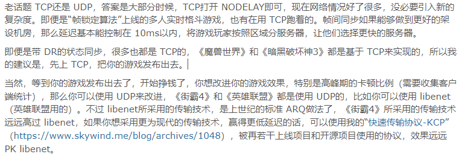
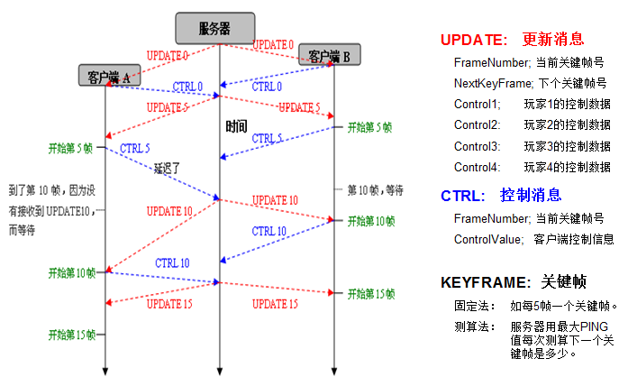

>转载请标明出处
## 前言

概览现有的帧同步视频资料与文档资料，要不就是仅仅简述一个帧同步的架构，再就是以及写好了一个比较具有规模的帧同步框架，什么**定点数**，**UDP**，**自定义物理同步**一应俱全，一时间让读者摸不着头脑。

本教程从一个**小DEMO**出发，从最古早的**帧锁定同步算法**开始逐步讲解**追帧**、**录像回放**、**预测回滚**

本DEMO的基础是[ancientElement/NetGameBook (github.com)](https://github.com/ancientElement/NetGameBook)TCP通信框架。

有的同学就会说：为什么用**TCP**呢，为什么不用**UDP**？

其实，在初期学习，我都想要将学习成本尽可能的压缩，现在刚好有不需要处理**乱序**和**丢包**的TCP干嘛不去用呢？

这里引用一下SkyWind的话：


<center>图1 TCP还是UDP</center>

其实帧同步和状态同步，在我的理解中，**帧同步**是转发**操作**，**状态同步**是转发**结果**。

帧同步还需要经过**操作输入--》模拟**，的过程才可以得到结果，这就导致了一个问题，**后来的**客户端怎么办，他没有收到到过**其他玩家**之前的操作输入怎么得到其他玩家**现在的状态**，难不成要储存一个玩家状态发送给**后加入的玩家吗**？

NONONO，早期的话，可以设计成**全部的玩家进入**才会开始游戏，这样所有玩家的都会有**相同的**操作输入。并且这样的设计是无法实现**掉线重连**和**后来加入**的。

要设计成为支持掉线重连，需要保存一个所有玩家的**每帧**操作输入。有玩家加入之后，他的客户端本地发送一个更新**第0帧**操作的消息，服务器收到以后，发现卧槽我到跑到**第10帧**了这老弟还要更新**第0帧**，在统一发送第10帧时，单独针对发送给这个老弟的消息中将**第0帧到第10帧**的所有操作打包，其他人的照成不变。

老弟服务器接收到**第0帧到第10帧**的所有操作后，将其玩家的输入操作**快速模拟**一遍直到**第10帧**，真就是为什么你打**王者荣耀**的时候掉线了，重新连接后会有自己和其他玩家的**快速影像**。


### 帧同步和状态同步的对比

#### 状态同步的方案特点

- 优点
  
    - **安全**（因为有关键逻辑都在服务器上）
      
    - **网络要求低**
      
    - **断线重回快**（因为有状态快照）
      
    - **客户端性能优化**（视野之外逻辑可以不要的，反正服务器在算全局的）。所以千人大战这种一定是C/S架构的。
      
    
- 缺点
  
    - **开发慢**（因为要联调）
      
    - **录像回放实现较难**
      
    - **打击感难调**
      
    - **耗流量**

#### 帧同步的方案特点

- 优点和缺点恰好是状态同步方案的互补。其中外挂是一个重点，而断线重回时间长是一个难点，不能胜任千人大战是无法突破的瓶颈（因为所有东西都要放在客户端算）。

此外，帧同步常用到buffer，其延迟比状态同步是要大的。

## 帧锁定同步算法-从Demo开始讲解

可以参考一下这一张图片的流程：


<center>图2 帧锁定同步流程图</center>

文字流程：

服务器
1. 玩家就位后发送**第0帧**的操作，第0帧都是空操作。
2. 等待**第1帧**的所有玩家接收操作到位。
	1. 接收到位后，广播所有玩家当前帧操作，当前帧加一。

客户端：
1. 等到**第0帧**的到来，**第0帧**没到不允许上传操作。
	1. 接收到第0帧后，更新逻辑帧。
2. 接收到**第0帧**后，等待66ms（FPS：15）搜集并且上传**第1帧**的操作，没有接收到不允许上传。

>没错就是这么简单，都说了是浅入浅出。

### 玩家脚本

帧同步的性质决定了，`BasePlayer`脚本中只能**模拟**，**输入**只能由外部给到。在`OnLogicUpdate`函数中，根据参数`PlayerInputData`来模拟当前帧的逻辑操作。

在**逻辑层面**更新速度只有**15FPS**，距离**60FPS**，差了很大一段路程，如果按照我们的逻辑帧来更新显示，画面将会非常不堪🙈。

这里逻辑帧更新仅仅通过输入计算**得到结果**，并不做画面上的更新，如下：

```C#
protected virtual void MoveUpdate(float delta, PlayerInputData playerInput)  
{  
    Move(delta, playerInput);  
}

public void Move(float delta, PlayerInputData playerInput)  
{  
    var direction = new Vector3(playerInput.JoyX, 0, playerInput.JoyY);  
    m_targetPos += direction.normalized * m_velocity * delta;  
}
```

由于我们是操作角色运动，我们将实际的移动放在`OnFixedUpdate`中，如下：

```C#
public void OnFixedUpdate(float delta)  
{  
    m_go.transform.position = Vector3.MoveTowards(m_go.transform.position, m_targetPos, delta * m_velocity);  
}
```

附：

```C#
public class BasePlayer  
{  
	public enum STATEENUM  
	{  
		idle,  
		move  
	}  

	float m_velocity;  
	STATEENUM m_state;  
	GameObject m_go;  
	Vector3 m_targetPos;  

	public BasePlayer(STATEENUM state, GameObject gameObject, float velocity)  
	{  
		m_state = state;  
		m_go = gameObject;  
		m_velocity = velocity;  
		m_targetPos = m_go.transform.position;  
	}  

	public void OnFixedUpdate(float delta)  
	{  
		m_go.transform.position = Vector3.MoveTowards(m_go.transform.position, m_targetPos, delta * m_velocity);  
	}  

	public void OnLogicUpdate(float delta, PlayerInputData playerInput)  
	{  
		if (playerInput.JoyX != 0 ||  
			playerInput.JoyY != 0)  
		{  
			m_state = STATEENUM.move;  
		}  
		else  
		{  
			m_state = STATEENUM.idle;  
		}  

		switch (m_state)  
		{  
			case STATEENUM.idle:  
				IdleUpdate(delta);  
				break;  
			case STATEENUM.move:  
				MoveUpdate(delta, playerInput);  
				break;  
		}  
	}  

	protected virtual void MoveUpdate(float delta, PlayerInputData playerInput)  
	{  
		Move(delta, playerInput);  
	}  

	protected virtual void IdleUpdate(float delta)  
	{  
		m_targetPos = m_go.transform.position;  
	}  

	public void Move(float delta, PlayerInputData playerInput)  
	{  
		var direction = new Vector3(playerInput.JoyX, 0, playerInput.JoyY);  
		m_targetPos += direction.normalized * m_velocity * delta;  
	}  
}  
```
### PlayerMgr

用来**注册玩家**、**发送注册消息**、**统一更新**所有玩家的**逻辑帧**、**表现帧**的管理脚本。

有点类似与`ECS`中的`System`的作用。

也类似与命令模式中的`CommadMgr`。

但是这里我们与命令模式不同，我们不储存任何状态，即使要存储，也会放到**服务端存储**。

我们需要在这里储存当前客户端的**玩家ID**，和其他玩家：

```C#
public int PlayerID { get; private set; } //控制的玩家的ID  
private Dictionary<int, BasePlayer> m_players; //键为ID
```

同时提供**发送注册玩家请求**、**监听其他注册玩家注册**等功能。

附：

```C#
public class PlayerMgr  
{  
    public int PlayerID { get; private set; } //控制的玩家的ID  
    private Dictionary<int, BasePlayer> m_players; //键为ID  
  
    public PlayerMgr()  
    {  
        m_players = new Dictionary<int, BasePlayer>();  
        PlayerID = -1;  
         
        NetAsyncMgr.AddNetMessageListener(MessagePool.RegisterMessage_ID, ReciveRegisterPlayer);  
        NetAsyncMgr.AddNetMessageListener(MessagePool.RegisterSelfMessage_ID, ReciveRegisterSelfPlayer);  
    }  
  
    /// <summary>  
    /// 逻辑更新,受到更新消息后更新  
    /// </summary>  
    /// <param name="msg"></param>    
    public void OnLogincUpdate(UpdateMessageData updateData)  
    {  
        for (int i = 0; i < updateData.PlayerInputs.Count; i++)  
        {  
            var playerInput = updateData.PlayerInputs[i];  
            var ID = playerInput.PlayerID;  
            m_players[ID].OnLogicUpdate(updateData.Delta, playerInput);  
        }  
    }  
  
    public void OnFixedUpdate(float delta)  
    {  
        for (int i = 0; i < m_players.Count; i++)  
        {  
            m_players[i].OnFixedUpdate(delta);  
        }  
    }  
  
    /// <summary>  
    /// 发送注册当前客户端玩家  
    /// </summary>  
    public void SendRegisterPlayer()  
    {  
        RegisterSelfMessage registerSelfMsg = new RegisterSelfMessage();  
        NetAsyncMgr.Send(registerSelfMsg);  
    }  
  
    /// <summary>  
    /// 接收注册自己  
    /// </summary>  
    public void ReciveRegisterSelfPlayer(BaseMessage msg)  
    {  
        RegisterSelfMessage registerSelfMessage = msg as RegisterSelfMessage;  
        PlayerID = registerSelfMessage.data.PlayerID;  
        RegisterPlayer(registerSelfMessage.data.PlayerID);  
    }  
  
    /// <summary>  
    /// 接收注册玩家  
    /// </summary>  
    public void ReciveRegisterPlayer(BaseMessage msg)  
    {  
        RegisterMessage registerMsg = msg as RegisterMessage;  
        RegisterPlayer(registerMsg.data.PlayerID);  
    }  
  
    /// <summary>  
    /// 真正注册玩家  
    /// </summary>  
    /// <param name="playerID"></param>    
    /// <exception cref="NotImplementedException"></exception>    
    private BasePlayer RegisterPlayer(int playerID)  
    {  
        var prefab = Resources.Load<GameObject>("Player");  
  
        var go = GameObject.Instantiate(prefab);  
  
        BasePlayer player = new BasePlayer(BasePlayer.STATEENUM.idle, go, 3f);  
        m_players.Add(playerID, player);  
  
        AEDebug.Log("注册玩家");  
  
        return player;  
    }  
}
```
### NetTick

这个脚本中实现了，上面流程中的所有客户端操作，要注意看哦(⊙o⊙)。

接收`UpdateMessage`，搜集玩家操作上传`Upload`。

我们上传操作时如果服务器没有下放**第0帧**，或者**未接收**到**上一次上传的操作**，都不能上传下一帧
	如过我们已经接收到**上一次上传的操作**的操作，等待66ms再次上传，同时`m_reciveFromLastUpLoad`置为`false`：

```C#
private void Upload(float delta)  
{  
    //如果没有接收到当前帧则等待  
    if (m_playerMgr.PlayerID == -1) return;  
    if (!m_reciveFromLastUpLoad) return;  
    m_timer += delta;  
    if (m_timer >= m_upLoadInterval)  
    {  
        m_timer = 0;  
        UpLoad();  
        AEDebug.Log("发布:" + (m_curFrame + 1) + "帧数据");  
        m_reciveFromLastUpLoad = false;  
    }  
}
```

在接收时判断收到的帧数据，是否是当前帧的下一帧，是则更新数据，并且同时`m_reciveFromLastUpLoad`置为`true`，表示**接收**到**上一次上传的操作**。

```C#
private void ReciveUpdateMessage(BaseMessage msg)  
{  
    var updateMessage = msg as UpdateMessage;  
    var updateDate = updateMessage.data;  
    if (updateDate.CurFrameIndex == m_curFrame + 1)  
    {  
        m_curFrame = updateDate.CurFrameIndex;  
        m_reciveFromLastUpLoad = true;  
        m_playerMgr.OnLogincUpdate(updateDate);  
    }  
  
    AEDebug.Log(updateDate.Delta);  
    AEDebug.Log("接收到第:" + updateDate.CurFrameIndex + "帧数据");  
}
```

附录：

```C#
public class NetTick : MonoBehaviour  
{  
	private int m_curFrame;  
	private bool m_reciveFromLastUpLoad;  

	private float m_upLoadInterval; //单位秒 间隔多少上传数据  
	private float m_timer; //计时器  

	PlayerMgr m_playerMgr;  

	[SerializeField] private string m_serverIP;  
	[SerializeField] private int m_port;  
	[SerializeField] private int m_FPS;  

	[ContextMenu("开启连接")]  
	public void StartConnect()  
	{  

		NetAsyncMgr.ClearNetMessageListener();  

		m_curFrame = -1;  
		m_timer = 0;  
		SetFPS(m_FPS);  
		m_playerMgr = new PlayerMgr();  

		NetAsyncMgr.AddNetMessageListener(MessagePool.UpdateMessage_ID, ReciveUpdateMessage);  
		NetAsyncMgr.SetMaxMessageFire(m_FPS);  

		NetAsyncMgr.Connect(m_serverIP, m_port);  
	}  
	  
#if Test  
	[ContextMenu("测试发送注册自己")]  
	public void TestSendRegisterSelfPlayer()  
	{  
		m_playerMgr.SendRegisterPlayer();  
	}  

	[ContextMenu("测试开始同步")]  
	public void TestSendStartRoom()  
	{  
		var startRoomMsg = new StartRoomMassage();  
		NetAsyncMgr.Send(startRoomMsg);  
		AEDebug.Log("开始同步");  
	}  

	[ContextMenu("测试as需要消耗多少时间")]  
	public void TestAsCostTime()  
	{  
		var oldTime = DateTime.Now;  
		for (int i = 0; i < 10000; i++)  
		{  
			BaseMessage msg = new StartRoomMassage();  
			var startRoomMsg = msg as StartRoomMassage;  
		}  

		var newTime = DateTime.Now;  
		var interval = newTime - oldTime;  
		AEDebug.Log(interval.TotalMilliseconds);  
	}  
#endif  
	private void Update()  
	{  
		NetAsyncMgr.FireMessage();  
		if (!NetAsyncMgr.IsConnected) return;  
		Upload(Time.deltaTime);  
	}  

	private void FixedUpdate()  
	{  
		if (!NetAsyncMgr.IsConnected) return;  
		m_playerMgr.OnFixedUpdate(Time.fixedDeltaTime);  
	}  

	/// <summary>  
	/// 接收帧数据  
	/// </summary>  
	/// <param name="msg"></param>        
    private void ReciveUpdateMessage(BaseMessage msg)  
	{  
		var updateMessage = msg as UpdateMessage;  
		var updateDate = updateMessage.data;  
		if (updateDate.CurFrameIndex == m_curFrame + 1)  
		{  
			m_curFrame = updateDate.CurFrameIndex;  
			m_reciveFromLastUpLoad = true;  
			m_playerMgr.OnLogincUpdate(updateDate);  
		}  

		AEDebug.Log(updateDate.Delta);  
		AEDebug.Log("接收到第:" + updateDate.CurFrameIndex + "帧数据");  
	}  

	/// <summary>  
	/// 上传玩家消息  
	/// </summary>  
	private void Upload(float delta)  
	{  
		//如果没有接收到当前帧则等待  
		if (m_playerMgr.PlayerID == -1) return;  
		if (!m_reciveFromLastUpLoad) return;  
		m_timer += delta;  
		if (m_timer >= m_upLoadInterval)  
		{  
			m_timer = 0;  
			UpLoad();  
			AEDebug.Log("发布:" + (m_curFrame + 1) + "帧数据");  
			m_reciveFromLastUpLoad = false;  
		}  
	}  

	/// <summary>  
	/// 上传玩家消息  
	/// </summary>  
	private void UpLoad()  
	{  
		UpLoadMessage upLoadMsg = new UpLoadMessage();  
		var playerInput = upLoadMsg.data;  

		playerInput.JoyX = Input.GetAxis("Horizontal");  
		playerInput.JoyY = Input.GetAxis("Vertical");  
		playerInput.PlayerID = m_playerMgr.PlayerID;  
		playerInput.CurFrameIndex = m_curFrame + 1;  

		NetAsyncMgr.Send(upLoadMsg);  
		// AEDebug.Log("上传数据");  
	}  

	/// <summary>  
	/// 设置上传帧率  
	/// </summary>  
	/// <param name="FPS"></param>        private void SetFPS(int FPS)  
	{  
		m_upLoadInterval = 1f / FPS;  
	}  
}  
```
### 服务器Room

`Room`代表一个房间，这里监听**成员是否就绪**、**成员注册**、**接收玩家输入**等消息。

这里也是实现了**上面流程**中提到的**服务器**大部分内容。

在后期实现**多房间系统**，仅仅只要在消息中多加一个**房间号**，使用RoomMgr来再次**分发房间消息**。

**帧数据**直接存在消息里面`private UpdateMessage m_currentFrameplayerInputs;`方便发送，但是切记要清空，/(ㄒoㄒ)/。

如何**判断**是否**收到所有**帧数据呢？`private Dictionary<int, bool> m_IDRecived;`用一个字典存取，但是切记要清空，/(ㄒoㄒ)/。

接收到房间开始后，**下发第一帧空操作**：

```C#
private void StartRoom(BaseMessage message, ClientSocket socket)  
{  
    CurFrame = 0;  
    m_lastSendUpdateMsg = DateTime.Now;  
  
    m_currentFrameplayerInputs.data.CurFrameIndex = CurFrame;  
    m_currentFrameplayerInputs.data.NextFrameIndex = CurFrame + 1;  
    foreach (var item in m_players)  
    {  
        var playerInput = new PlayerInputData();  
        playerInput.PlayerID = item.Key;  
        playerInput.JoyX = 0;  
        playerInput.JoyY = 0;  
        m_currentFrameplayerInputs.data.PlayerInputs.Add(playerInput);  
    }  
  
    socket.serverSocket.Broadcast(m_currentFrameplayerInputs);  
    m_currentFrameplayerInputs.data.PlayerInputs.Clear();  
    Debug.Log("接收到房间开始并发布第0帧");  
}
```

下面是我们的**重头戏**，接收**各个玩家的操作**，如果接收的操作是服务器上**下一帧的操作**，**添加**进帧数据中，并且在` m_IDRecived`这个登记表中**打勾**，判断是否接收**到位**，到位之后转发，服务器**逻辑帧+1**。

```C#
private void RecivePlayerInput(BaseMessage message, ClientSocket socket)  
{  
    lock (m_currentFrameplayerInputs)  
    {  
        var upLoadMessage = message as UpLoadMessage;  
        if (upLoadMessage.data.CurFrameIndex == CurFrame + 1)  
        {  
            m_IDRecived[upLoadMessage.data.PlayerID] = true;  
            m_currentFrameplayerInputs.data.PlayerInputs.Add(upLoadMessage.data);  
  
            Debug.Log("接收第" + upLoadMessage.data.CurFrameIndex + "帧");  
            foreach (var item in m_IDRecived.Values)  
            {  
                if (!item)  
                {  
                    return;  
                }  
            }  
  
            //服务器帧更新  
            CurFrame += 1;  
            var span = DateTime.Now - m_lastSendUpdateMsg;  
            m_lastSendUpdateMsg = DateTime.Now;  
            Debug.Log(span.TotalSeconds.ToString());  
            //广播  
            m_currentFrameplayerInputs.data.CurFrameIndex = CurFrame;  
            m_currentFrameplayerInputs.data.NextFrameIndex = CurFrame + 1;  
            m_currentFrameplayerInputs.data.Delta = (float)span.TotalSeconds;  
            socket.serverSocket.Broadcast(m_currentFrameplayerInputs);  
            Debug.Log("发布第" + upLoadMessage.data.CurFrameIndex + "帧");  
            //清理  
            m_currentFrameplayerInputs.data.PlayerInputs.Clear();  
            for (int i = 0; i < m_IDRecived.Count; i++)  
            {  
                m_IDRecived[i] = false;  
            }  
        }  
    }  
}
```

多线程问题，服务器端使用线程池接收数据，会同时到达两个帧数据。

>在 C# 中，当两个线程同时修改一个共享资源时，可能会导致**竞态条件**（Race Condition）的发生，从而引发意外的结果或者未定义的行为。

使用线程锁,防止产生**竞态条件**，

```C#
private object lockObject = new object();
private int sharedResource;

// 在修改共享资源时使用锁
lock (lockObject)
{
    // 修改共享资源的代码
    sharedResource = newValue;
}

```

附：

```C#
public class Room  
{  
	public int CurFrame { get; private set; }  

	private Dictionary<int, ClientSocket> m_players;  

	private UpdateMessage m_currentFrameplayerInputs;  
	private Dictionary<int, bool> m_IDRecived;  

	private DateTime m_lastSendUpdateMsg;  

	public Room()  
	{  
		m_currentFrameplayerInputs = new UpdateMessage();  
		m_players = new Dictionary<int, ClientSocket>();  
		m_IDRecived = new Dictionary<int, bool>();  

		ClientSocket.AddListener(MessagePool.UpLoadMessage_ID, RecivePlayerInput);  
		ClientSocket.AddListener(MessagePool.RegisterSelfMessage_ID, ReciveRegisterSelfPlayer);  
		ClientSocket.AddListener(MessagePool.HeartMessage_ID, ReciveHearMessage);  
		ClientSocket.AddListener(MessagePool.StartRoomMassage_ID, StartRoom);  
	}  

	/// <summary>  
	/// 房间开始  
	/// </summary>  
	/// <param name="message"></param>        
    /// <param name="socket"></param>        
    private void StartRoom(BaseMessage message, ClientSocket socket)  
	{  
		CurFrame = 0;  
		m_lastSendUpdateMsg = DateTime.Now;  

		m_currentFrameplayerInputs.data.CurFrameIndex = CurFrame;  
		m_currentFrameplayerInputs.data.NextFrameIndex = CurFrame + 1;  
		foreach (var item in m_players)  
		{  
			var playerInput = new PlayerInputData();  
			playerInput.PlayerID = item.Key;  
			playerInput.JoyX = 0;  
			playerInput.JoyY = 0;  
			m_currentFrameplayerInputs.data.PlayerInputs.Add(playerInput);  
		}  

		socket.serverSocket.Broadcast(m_currentFrameplayerInputs);  
		m_currentFrameplayerInputs.data.PlayerInputs.Clear();  
		Debug.Log("接收到房间开始并发布第0帧");  
	}  

	/// <summary>  
	/// 接收到玩家操作  
	/// </summary>  
	/// <param name="message"></param>        /// <param name="socket"></param>        private void RecivePlayerInput(BaseMessage message, ClientSocket socket)  
	{  
		lock (m_currentFrameplayerInputs)  
		{  
			var upLoadMessage = message as UpLoadMessage;  
			if (upLoadMessage.data.CurFrameIndex == CurFrame + 1)  
			{  
				m_IDRecived[upLoadMessage.data.PlayerID] = true;  
				m_currentFrameplayerInputs.data.PlayerInputs.Add(upLoadMessage.data);  

				Debug.Log("接收第" + upLoadMessage.data.CurFrameIndex + "帧");  
				foreach (var item in m_IDRecived.Values)  
				{  
					if (!item)  
					{  
						return;  
					}  
				}  

				//服务器帧更新  
				CurFrame += 1;  
				var span = DateTime.Now - m_lastSendUpdateMsg;  
				m_lastSendUpdateMsg = DateTime.Now;  
				Debug.Log(span.TotalSeconds.ToString());  
				//广播  
				m_currentFrameplayerInputs.data.CurFrameIndex = CurFrame;  
				m_currentFrameplayerInputs.data.NextFrameIndex = CurFrame + 1;  
				m_currentFrameplayerInputs.data.Delta = (float)span.TotalSeconds;  
				socket.serverSocket.Broadcast(m_currentFrameplayerInputs);  
				Debug.Log("发布第" + upLoadMessage.data.CurFrameIndex + "帧");  
				//清理  
				m_currentFrameplayerInputs.data.PlayerInputs.Clear();  
				for (int i = 0; i < m_IDRecived.Count; i++)  
				{  
					m_IDRecived[i] = false;  
				}  
			}  
		}  
	}  

	/// <summary>  
	/// 接收注册消息  
	/// </summary>  
	/// <param name="message"></param>        
    /// <param name="socket"></param>        
    private void ReciveRegisterSelfPlayer(BaseMessage message, ClientSocket socket)  
	{  
		if (m_players.ContainsValue(socket))  
		{  
			return;  
		}  

		foreach (var client in socket.serverSocket.clientSockets.Values)  
		{  
			//返回注册当前请求客户端  
			if (socket == client)  
			{  
				//注册自己  
				RegisterSelfMessage registerSelfMessage = new RegisterSelfMessage();  
				registerSelfMessage.data.PlayerID = m_players.Count;  
				client.Send(registerSelfMessage);  
			}  
			//返回注册其他客户端  
			else  
			{  
				RegisterMessage registerMessage = new RegisterMessage();  
				registerMessage.data.PlayerID = m_players.Count;  
				client.Send(registerMessage);  
			}  
		}  

		m_IDRecived.Add(m_players.Count, false);  
		m_players.Add(m_players.Count, socket);  
	}  

	/// <summary>  
	/// 接收到心跳消息  
	/// </summary>  
	/// <param name="arg1"></param>        
    /// <param name="arg2"></param>        
    private void ReciveHearMessage(BaseMessage arg1, ClientSocket arg2)  
	{  
		Debug.Log("心跳消息");  
	}  
}  
```

### BUGS

每次**间隔66ms**真的是间隔66ms才**收集数据**吗,而不是**提前收集数据**等到66ms再去发送吗?
我怀疑这是**输入不灵敏**的一个原因。

现在总算是直到为啥要用自己的物理引擎做帧同步了，因为Unity的物理引擎没办法根据我们自己的逻辑帧来更新，**逻辑帧**更新和**物理帧**更新时间点**不一致**，导致**相同的输入**，**不同的输出**，这是帧同步**最忌讳的**。

## 追帧

其实在TCP中 不太可能出现掉包，因为TCP的**丢包重发机制**和**有序性**

如果要引入**追帧**这个概念，那么服务端不能再**等待**所有客户的操作，必须也是以**一定时间**接收玩家的操作，如果时间到了还未到的玩家操作服务器将会认为是**空操作**，直接将下一帧发出去，服务器**逻辑帧+1**。

这里**一定时间**最好是与客户端发送同步的时间，可是要是客户端传输时间**皆大于**服务器的等待时间怎么办？那岂不是每一帧都是**空操作**？

我们先暂且将服务器等待时间**略大于**客户端时间，但是同样的，如果在等到时间前**都到齐**了，**发送下一帧**，服务器**逻辑帧+1**。

服务器在接收的时候，判断接收的帧是否是当前帧，如果不是则

客户端：该我出场了。

如果客户端接收到大于当前帧的数据